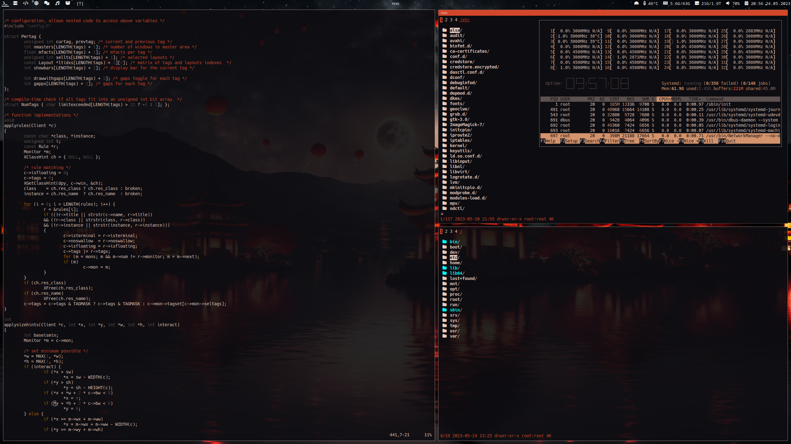

# Personalized DWM Fork

This repository contains my personalized fork of DWM (Dynamic Window Manager). It has been modified, patched, and customized to suit my specific preferences and requirements.

Feel free to explore and adapt this personalized DWM fork to suit your own workflow and aesthetic preferences.

## Screenshot



## Applied Patches

- `alpha-systray`: Adds support for system tray with alpha channel transparency.
- `functionalgaps+pertag`: Implements functional gaps and per-tag gaps, allowing for flexible gaps customization.
- `statuscmd`: Adds the ability to signal a status monitor program.
- `centretitle`: Centers the window title text in the title bar.
- `underlinetags`: Adds an underline to the selected tag in the status bar.
- `attachtop`: Makes newly created windows attach to the top of the stack.
- `xrdb`: Allows DWM to read color settings from the X resources database (xrdb).
- `alwaysontop`: Adds the ability to keep selected windows always on top.
- `alwayscenter`: Centers floating windows by default.
- `swallow`: Implements window swallowing, automatically taking over the parent window when a child process is launched.
- `focusonnetactive`: Focuses the last focused window when the currently focused window is closed.

## Installation

1. Clone the repository to your local machine.
   ```shell
   git clone https://github.com/AkamQadiri/dwm
   ```

2. Compile and install DWM by running the following command within the cloned repository:
   ```shell
   sudo make clean install
   ```